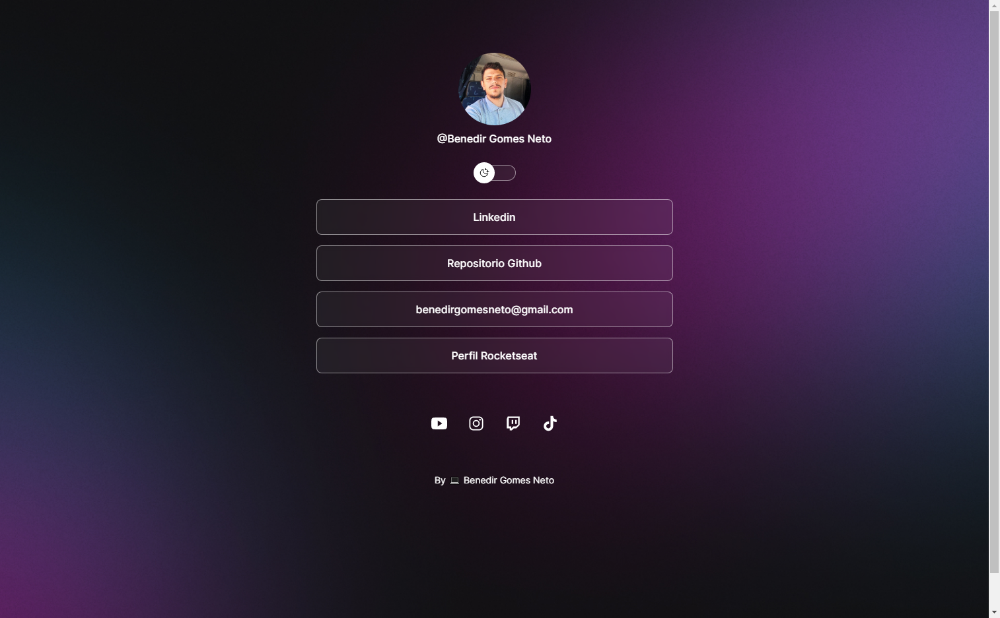

# Social Mídia

Projeto promovido pela Rocketseat para aprendizado de tecnologias WEB.

## 🚀 Tecnologias

Esse projeto foi desenvolvido com as seguintes tecnologias:

- HTML e CSS
- JavaScript
- Git e Github
- Figma

## 💻 Projeto

O Social Mídia é um agregador de links para usar como cartão de visitas online.

- [Acesse o projeto finalizado, online](https://benedirgomesneto.github.io/Social_midia/)

## :memo: Considerações

Esse projeto foi feito em aula, disponibilizado por Rocketseat

## 🔖 Layout

Você pode visualizar o layout do projeto através [DESSE LINK](https://www.figma.com/community/file/1187422022288947321). É necessário ter conta no [Figma](https://figma.com) para acessá-lo.

---

By Benedir Gomes Neto :wave: [Entre em contato!](https://www.linkedin.com/in/benedir-gomes-neto-9b4aa5250/)

benedirgomesneto@gmail.com
